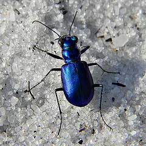
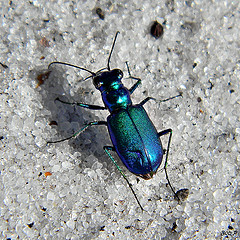

The `figure` element can be used to group a set of images into a single figure with a shared caption.

Here, a pair of images are grouped and presented with a single caption:

```
<figure>
  
  
  <figcaption>A pair of Festive Tiger Beetles, showing off their iridescent shells.</figcaption>
</figure>
```

The result looks like this:

<div>
  <figure>
    
    
    <figcaption>A pair of Festive Tiger Beetles, showing off their iridescent shells.</figcaption>
  </figure>
</div>

Beetle images in this article are courtesy of [Bob Peterson](https://www.flickr.com/photos/pondapple/).
