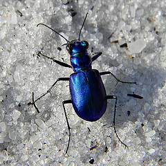
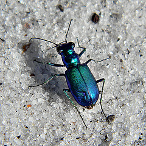

The `figure` elements can be nested, presenting a group of figures under a single caption. Each nested figure can also have its own caption.

Here, a pair of `figure`s are grouped into a parent `figure`. Both of the child `figure` elements have their own caption, as does the parent `figure`. This allows the parent `figure` to caption the `figure`s as a group, while each child `figure` can add a caption specific to its own content.

```
<figure>
  <figcaption>A pair of Festive Tiger Beetles, showing some of the range of color in the species.</figcaption>
  <figure>
    
    <figcaption>A blue tiger beetle.</figcaption>
  </figure>
  <figure>
    
    <figcaption>A green-tinted tiger beetle.</figcaption>
  </figure>
</figure>
```

The result looks like this:

<figure>
  <figcaption>A pair of Festive Tiger Beetles, showing some of the range of color in the species.</figcaption>
  <figure>
    
    <figcaption>A blue tiger beetle.</figcaption>
  </figure>
  <figure>
    
    <figcaption>A green-tinted tiger beetle.</figcaption>
  </figure>
</figure>

Beetle images in this article are courtesy of [Bob Peterson](https://www.flickr.com/photos/pondapple/).
